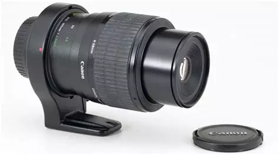
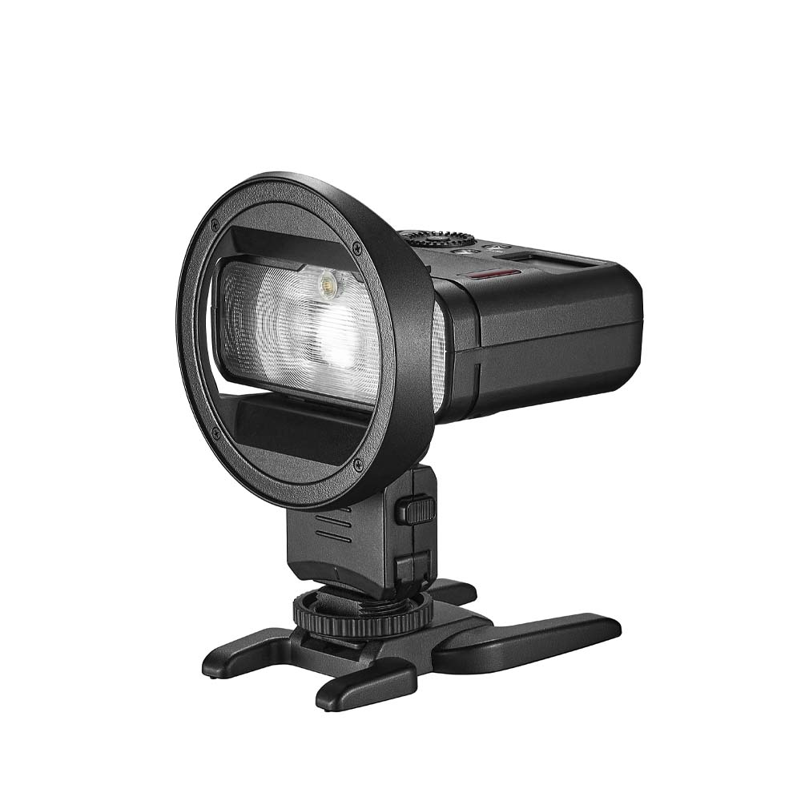
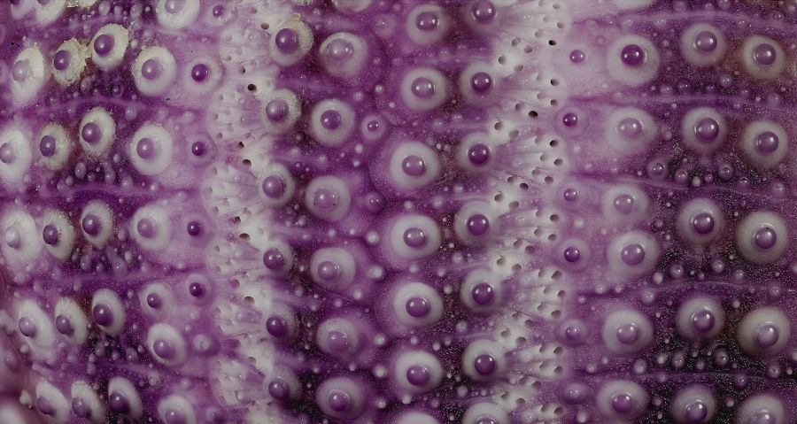

# Polarisation croisée : introduction

Je me suis livré récemment à quelques essais de polarisation croisée en macro. C'est finalement plus facile que je ne le pensais. Le but étant bien entendu de se débarrasser des reflets indésirables sur des sujets réfléchissants. J'ai commencé par le plus facile : une seule source continue. Pour terminer par plus compliqué : utilisation de deux flashes. C'est cette "recette" finale que je vous présente. Je divise ce billet en plusieurs épisodes pour éviter une longueur excessive...

## Le matériel utilisé

Pour la prise de vue proprement dite, j'ai utilisé ici un Canon R6 MKII muni d'un objectif bien spécifique. Le mythique MPE 65mm f/2.8 dont Canon a aujourd'hui arrêté la fabrication. Il fonctionne fort bien sur les EOS de série R, avec la bague d'adaptation appropriée.

{ width="475" }
/// caption
Objectif ultra-macro [MPE-65](https://fr.wikipedia.org/wiki/Canon_MP-E_65mm){:target="\_blank"}
///

### Les sources d'éclairage

Pour cette série, j'ai utilisé de petits flashs Godox. Alternativement, deux MF12, spécifiquement destinés à la macro, et deux AD100. De tout petits flash de studio que j'appécie beaucoup. Ils disposent de tout un jeu d'accessoires : porte-filtres, modificateur de lumière, diffuseurs divers. Pour quelques euros, Godox fournit un adaptateur, référencé _MF-CB_, qui permet d'utiliser les accessoires de la gamme AD100 sur les MF12.

{ width="475" }
/// caption
Flash macro Godox MF-12 avec adaptateur MF-CB
///

### Les filtres

Si vous avez déjà utilisé un polarisant pour vos photos de paysage, vous savez que ce filtre permet d'assombrir les ciels bleus et de gérer les reflets spéculaires. Le filtre est rotatif : vous le faites tourner jusqu'a obtenir l'effet d'assombrissement souhaité.
Mais en macro, à priori, cela ne fonctionne pas, ou mal. En effet, si la lumière du soleil est bien polarisée, celle de vos LED ou flashes ne l'est pas. Il faut donc modifier votre source lumineuse pour que cette lumière-là soit effectivement polarisée. En adaptant un filtre polarisant sur **chacune** de vos sources lumineuses.

Le matériel spécifique utilisé se résume à peu de choses : un filtre polarisant circulaire et une plaque de film polarisant linéaire[^1].

Le film polarisant linéaire vaut environ 10 euros pour une feuille de format A5. Si le filtre destiné à l'objectif doit être de bonne qualité pour ne pas dégrader l'image, il n'en va pas de même pour ceux destinés aux sources lumineuses.
Attention, évitez les films adhésifs, qui compliqueraient bien les manipulations. Les films sont revêtus, sur les deux faces, d'une pellicule de protection, qu'il faudra enlever.

!!! info "Pensez aux réducteurs"
    Si vous n'avez pas de filtre circulaire pour votre appareil, achetez-le au diamètre du plus gros objectif sur lequel vous comptez l'utiliser et ajoutez quelques bagues de réduction pour les autres optiques. Beaucoup, beaucoup moins cher que d'acquérir des filtres de différents diamètres.
    Pour éviter un empilement de bagues, pas de jeux complets. Prenez uniquement les réducteurs (_step-down_) qui _sautent_ en une fois de la taille du filtre à celle de l'objectif. J'ai un filtre polarisant en 77mm et deux réducteurs : un 77mm vers 72mm et un 77mm vers 67mm.

### Test du filtre

Pour tester votre film, rien de plus simple. Tenez-le devant votre écran d'ordinateur, qui diffuse un lumière polarisée et faites tourner le film. La lumière transmise va diminuer progressivement jusqu'à arriver à un minimum, la position d'extinction. Notez cette position d'extinction par une petite flèche au marqueur sur le film. Ceci nous servira de repère pour le prochain épisode...

## Exemple de départ

Voici le test d'oursin qui m'a servi de sujet pour l'ensemble des manipulations. Sur la photo ci-dessous, remarquez les reflets bien présents sur les bases des piquants. Deux sources lumineuses, deux taches blanches par piquant. C'est ma photo de départ, sans polarisation.

{ width="900" }
/// caption
Test d'oursin - pas de polarisation
///

[^1]: J'ai trouvé mon [polarisant linéaire](https://www.amazon.fr/dp/B08XWDJ4GM?ref=ppx_yo2ov_dt_b_fed_asin_title){:target="\_blank"} sur Amazon, au milieu d'un choix abondant.
