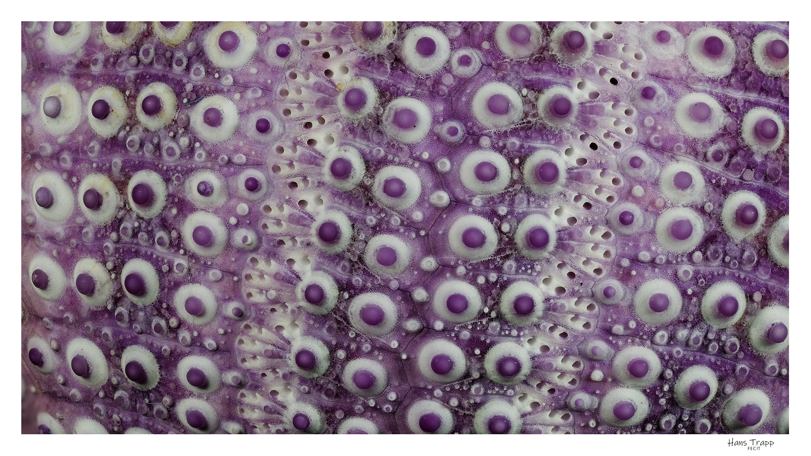

# Polarisation croisée : réglages

Si vous n'utilisez qu'une seule source lumineuse, le réglage de la polarisation croisée sera très simple. Avec deux sources, c'est un peu plus compliqué... Mais je vous propose une façon de faire qui me permet de maîtriser rapidement mes éclairages.

## Avec une seule source

Pour la prise de vue proprement dite, j'ai utilisé ici un Canon R6 MKII muni d'un objectif bien spécifique. Le mythique MPE 65mm f/2.8 dont Canon a aujourd'hui arrêté la fabrication. Il fonctionne fort bien sur les EOS de série R, avec la bague d'adaptation appropriée.

### Les sources d'éclairage

Pour cette série, j'ai utilisé de petits flashs Godox. Alternativement, deux MF12, spécifiquement destinés à la macro, et deux AD100. De tout petits flash de studio que j'appécie beaucoup. Ils disposent de tout un jeu d'accessoires : porte-filtres, modificateur de lumière, diffuseurs divers. Pour quelques euros, Godox fournit un adaptateur, référencé _MF-CB_, qui permet d'utiliser les accessoires de la gamme AD100 sur les MF12.

!!! info "Tethered shooting"
    Pas de traduction française pertinente pour cette expression. Déport de la visée de l'appareil photo vers un ordinateur, pour bénéficier du confort et de la précision d'un grand écran. L'APN est relié par un cable USB à l'ordinateur, où est installé un logiciel idoine. Canon fournit les _EOS Utilities_ pour ce faire. Il existe évidemment des équivalents pour les autres marques. Pour ma part, j'utilise [Helicon Remote](https://www.heliconsoft.com/heliconsoft-products/helicon-remote/){:target="\_blank"}, payant, mais aux très larges capacités.

### Les filtres

Si vous avez déjà utilisé un polarisant pour vos photos de paysage, vous savez que ce filtre permet d'assombrir les ciels bleus et de gérer les reflets spéculaires. Le filtre est rotatif : vous le faites tourner jusqu'a obtenir l'effet d'assombrissement souhaité.
Mais en macro, à priori, cela ne fonctionne pas, ou mal. En effet, si la lumière du soleil est bien polarisée, celle de vos LED ou flashes ne l'est pas. Il faut donc modifier votre source lumineuse pour que cette lumière-là soit effectivement polarisée. En adaptant un filtre polarisant sur **chacune** de vos sources lumineuses.

Le matériel spécifique utilisé se résume à peu de choses : un filtre polarisant circulaire et une plaque de film polarisant linéaire.

Le film polarisant linéaire vaut environ 10 euros pour une feuille de format A5. Si le filtre destiné à l'objectif doit être de bonne qualité pour ne pas dégrader l'image, il n'en va pas de même pour ceux destinés aux sources lumineuses.
Attention, évitez les films adhésifs, qui compliqueraient bien les manipulations. Les films sont revêtus, sur les deux faces, d'une pellicule de protection, qu'il faudra enlever.

### Test du filtre

Pour tester votre film, rien de plus simple. Tenez-le devant votre écran d'ordinateur, qui diffuse un lumière polarisée et faites tourner le film. La lumière transmise va diminuer progressivement jusqu'à arriver à un minimum, la position d'extinction. Notez cette position d'extinction par une petite flèche au marqueur sur le film. Ceci nous servira de repère pour le prochain épisode...

### Avec deux sources

## Exemple final

Et re-voici le test d'oursin. Cette image est une zédification[^1] Sur la photo ci-dessous, remarquez la disparition des reflets. Deux flashs en polarisation croisée : mission accomplie.

{ width="900" }
/// caption
Test d'oursin - polarisation croisée avec deux flashs Godox MF-12.
///

[^1]: _Focus-stacking_ en bon français. Absent des dictionnaires usuels, mais décrit dans [Wikipedia](https://fr.wikipedia.org/wiki/Z%C3%A9dification){:target="\_blank"}.
